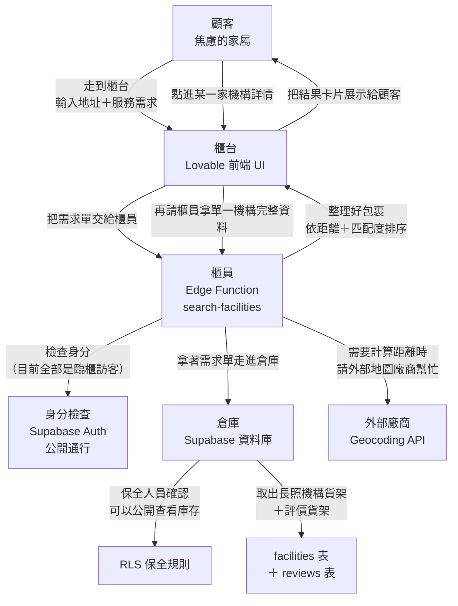

我已完成對現有前端程式碼與知識庫的靜默分析。  
目前的產品定位非常清楚：**完全公開、無需登入的長照機構搜尋**，核心是「輸入地址 → 依距離／服務匹配排序 → 查看詳情並聯絡」。

因為答案都能從程式碼與知識庫直接推導，不需要額外關鍵問題，我直接進入**階段 2：架構藍圖**。

---

# 階段 2：架構藍圖  
（最終要建置的完整後端架構，以郵局類比說明）

## 1. 視覺化資料流圖（櫃台 → 櫃員 → 倉庫）

**郵局白話說明：**  
顧客（家屬）走到櫃台（前端），告訴櫃員「我家住這裡，需要失智專區」。櫃員（Edge Function）走進倉庫（資料庫），保全人員（RLS）放行公開庫存，櫃員再請外部地圖廠商幫忙算出距離，最後把排好序的包裹（機構卡片）送回櫃台給顧客。

---

## 2. 貨架清單（資料表）與其標籤（結構描述）

### 主要貨架：`facilities`（長照機構庫存）

| 欄位 | 型別 | 說明（郵局標籤） |
|------|------|------------------|
| id | uuid (PK) | 包裹追蹤號碼 |
| name | text | 機構名稱 |
| image_url | text | 外觀照片 |
| address | text | 完整地址 |
| phone | text | 聯絡電話 |
| website | text (nullable) | 官方網站 |
| lat | double precision | 緯度（計算距離用） |
| lng | double precision | 經度（計算距離用） |
| rating | numeric(2,1) | 平均評分 |
| review_count | integer | 評價數量 |
| bed_count | integer | 床位數 |
| services | text[] | 有提供的服務（陣列） |
| is_dementia_friendly | boolean | 是否適合失智 |
| opening_hours | text | 開放時間 |
| created_at | timestamptz | 入庫時間 |
| updated_at | timestamptz | 最後更新 |

### 次要貨架：`reviews`（評價）

| 欄位 | 型別 | 說明 |
|------|------|------|
| id | uuid (PK) | 評價追蹤號碼 |
| facility_id | uuid (FK → facilities) | 屬於哪一家機構 |
| author | text | 評價者名稱 |
| rating | integer (1-5) | 星等 |
| content | text | 評價內容 |
| created_at | timestamptz | 評價時間 |

**為什麼把 reviews 獨立成表？**  
就像包裹追蹤系統：一個機構（主包裹）可以有很多評價（子追蹤單），方便之後擴充「真實使用者寫評價」而不用改主貨架結構。

---

## 3. 保全規則（誰能看到什麼）— RLS

因為目前是**臨櫃訪客**（完全公開、無登入）：

- `facilities`：任何人都可以 **SELECT**（公開庫存）
- `reviews`：任何人都可以 **SELECT**
- 目前不開放 INSERT / UPDATE / DELETE（沒有會員寫入評價的流程）

未來若要讓「持有鑰匙的會員」寫評價，只要再加一條 RLS 政策即可，現在先保持最簡單的公開讀取。

---

## 4. 身分檢查（驗證）

**目前策略：全部當作臨櫃訪客**  
- 不強制登入
- 不建立使用者私人信箱
- Supabase Auth 先開啟 Anonymous 或乾脆不擋任何公開查詢

之後若要加「收藏機構」或「寫評價」，再升級成「持有鑰匙的會員」。

---

## 5. 自助服務螢幕（Frontend Hooks）

前端櫃台只透過這兩個自助螢幕跟後端說話：

| Hook | 郵局類比 | 用途 |
|------|----------|------|
| `useFacilitiesSearch(address, services[])` | 顧客填寫「搜尋需求單」 | 輸入地址＋服務標籤，取得排序後的機構列表 |
| `useFacility(id)` | 顧客出示「單一包裹追蹤號碼」 | 取得某一家機構的完整資料（含評價） |

這兩個 hooks 內部會呼叫 Edge Function 或直接查 Supabase（依階段決定）。

---

## 6. 需要的後場專家（Edge Functions）

| 函式名稱 | 郵局類比 | 職責 |
|----------|----------|------|
| `search-facilities` | 專門負責「依地址找最近機構」的資深櫃員 | 1. 把顧客地址轉成座標（呼叫外部地圖廠商） 2. 從倉庫取出所有機構 3. 計算距離、套用服務匹配分數 4. 排序後回傳 |
| `get-facility` | 單一包裹查詢櫃員 | 依 id 回傳完整機構＋評價（可選，也可直接用 client 查詢） |

**為什麼需要 Edge Function？**  
因為計算距離需要「後場的安全鑰匙」（Geocoding API Key），不能放在櫃台（前端）讓大家看到。

---

## 7. 外部廠商連線（API）

| 廠商 | 用途 | 何時使用 |
|------|------|----------|
| Geocoding 服務（Google Maps / Mapbox / Nominatim） | 把「台北市大安區復興南路…」轉成 lat/lng | 只在 `search-facilities` 邊緣函式內使用 |

目前前端完全不碰外部 API，所有敏感鑰匙都鎖在後場。

---

## 8. 分階段建置順序（先建什麼）

1. **倉庫貨架建好**（建立 `facilities` + `reviews` 表 + 索引）
2. **貼上標籤與保全規則**（RLS：公開讀取）
3. **把現有模擬資料搬進倉庫**（seed 腳本）
4. **訓練後場專家**（實作 `search-facilities` Edge Function，先用假距離或簡單計算）
5. **櫃台換成真實對講機**（前端 hooks 改呼叫真實後端，拿掉 mockFacilities）
6. **接上外部地圖廠商**（真正的地址 → 座標 → 距離）
7. （可選）之後再加會員功能

---

# 階段 3：實作計畫（測試驅動 + 區塊式）

### 總原則
- 每個區塊都先寫失敗測試 → 實作 → 測試變綠 → 再往下
- 前端與邊緣函式都使用 Vitest
- 每完成一個區塊就停下來讓您在預覽模式驗證

### 區塊順序

**區塊 A：資料庫貨架**
- 建立 migration：`facilities`、`reviews` 表
- 加上必要索引（lat/lng、services GIN、facility_id）
- 寫入 seed 資料（把現有 8 筆 mock 轉成真實資料，並補上合理的 lat/lng）
- 測試：能正確查出資料

**區塊 B：保全規則**
- 開啟 RLS
- 政策：`SELECT` 對 `anon` 與 `authenticated` 都開放
- 測試：未登入也能讀取

**區塊 C：後場專家（search-facilities）**
- 先實作「不呼叫外部 API」的版本（用資料庫裡的 lat/lng + 簡單距離公式）
- 支援服務標籤過濾與匹配分數排序
- 完整日誌
- 測試：傳入地址與服務，回傳正確排序結果

**區塊 D：前端對接**
- 建立 `src/lib/supabase.ts` 與 hooks
- `HomePage` / `ResultsPage` / `FacilityDetailPage` 改成呼叫真實資料
- 移除 `mockFacilities.ts` 的依賴
- 測試：完整流程仍可跑通

**區塊 E：真實距離計算（可選進階）**
- 在 Edge Function 內接入 Geocoding
- 把 API Key 放進 Supabase Secrets
- 測試與錯誤處理（地址無法解析時的溫柔提示）

---

### 請您明確核准

以上就是我建議的**最終後端架構**與**分階段實作計畫**。

請回覆：
- **「核准架構，開始區塊 A」** → 我就從建立資料表開始
- 或告訴我您想調整的地方（例如：要不要現在就規劃會員收藏、評價寫入、或一定要接哪個地圖廠商）

我不會在收到明確核准前實作任何後端程式碼。